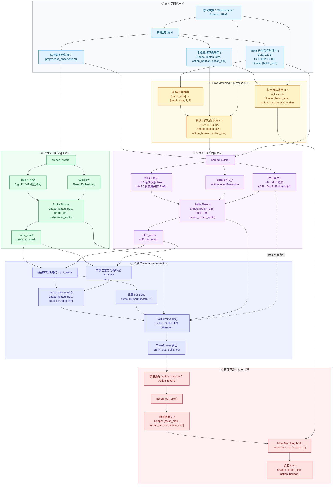

```mermaid
flowchart TB

    %% ==============================
    %% 1. 输入与随机采样
    %% ==============================

    subgraph S1["① 输入与随机采样"]
        direction TB
        A["输入数据：Observation / Actions / RNG"]
        B["随机密钥拆分"]
        C["观测数据预处理：preprocess_observation()"]
        D["生成标准正态噪声 ε<br/>Shape: [batch_size, action_horizon, action_dim]"]
        E["Beta 分布采样时间步 t<br/>Beta(1.5, 1)<br/>t = 0.999t + 0.001<br/>Shape: [batch_size]"]

        A --> B
        B --> C
        B --> D
        B --> E
    end

    %% ==============================
    %% 2. Flow Matching
    %% ==============================

    subgraph S2["② Flow Matching：构造训练样本"]
        direction TB
        F["扩展时间维度<br/>[batch_size] → [batch_size, 1, 1]"]
        G["构造中间动作状态 x_t<br/>x_t = tε + (1-t)A<br/>Shape: [batch_size, action_horizon, action_dim]"]
        H["构造目标速度 u_t<br/>u_t = ε - A<br/>Shape: [batch_size, action_horizon, action_dim]"]

        F --> G
    end

    E --> F
    D --> G
    A --> G
    D --> H
    A --> H

    %% ==============================
    %% 3. Prefix 编码
    %% ==============================

    subgraph S3["③ Prefix：视觉语言编码"]
        direction TB
        P1["embed_prefix()"]
        P2["摄像头图像<br/>SigLIP / ViT 视觉编码"]
        P3["语言指令<br/>Token Embedding"]
        P4["Prefix Tokens<br/>Shape: [batch_size, prefix_len, paligemma_width]"]
        P5["prefix_mask<br/>prefix_ar_mask"]

        P1 --> P2
        P1 --> P3
        P2 --> P4
        P3 --> P4
        P4 --> P5
    end

    %% ==============================
    %% 4. Suffix 编码
    %% ==============================

    subgraph S4["④ Suffix：动作特征编码"]
        direction TB
        Q1["embed_suffix()"]
        Q2["机器人状态<br/>π0：连续状态 Token<br/>π0.5：状态编码在 Prefix"]
        Q3["加噪动作 x_t<br/>Action Input Projection"]
        Q4["时间条件 t<br/>π0：MLP 融合<br/>π0.5：AdaRMSNorm 条件"]
        Q5["Suffix Tokens<br/>Shape: [batch_size, suffix_len, action_expert_width]"]
        Q6["suffix_mask<br/>suffix_ar_mask"]

        Q1 --> Q2
        Q1 --> Q3
        Q1 --> Q4
        Q2 --> Q5
        Q3 --> Q5
        Q4 --> Q5
        Q5 --> Q6
    end

    C --> P1
    C --> Q1
    G --> Q1
    E --> Q1

    %% ==============================
    %% 5. Attention
    %% ==============================

    subgraph S5["⑤ 联合 Transformer Attention"]
        direction TB
        M1["拼接有效性掩码 input_mask"]
        M2["拼接注意力分组标记 ar_mask"]
        M3["make_attn_mask()<br/>Shape: [batch_size, total_len, total_len]"]
        M4["计算 positions<br/>cumsum(input_mask) - 1"]
        M5["PaliGemma.llm()<br/>Prefix + Suffix 联合 Attention"]
        M6["Transformer 输出<br/>prefix_out / suffix_out"]

        M1 --> M3
        M2 --> M3
        M1 --> M4
        M3 --> M5
        M4 --> M5
        M5 --> M6
    end

    P5 --> M1
    Q6 --> M1
    P5 --> M2
    Q6 --> M2
    P4 --> M5
    Q5 --> M5
    Q4 -.->|π0.5 时间条件| M5

    %% ==============================
    %% 6. 速度预测与损失
    %% ==============================

    subgraph S6["⑥ 速度预测与损失计算"]
        direction TB
        N1["提取最后 action_horizon 个 Action Tokens"]
        N2["action_out_proj()"]
        N3["预测速度 v_t<br/>Shape: [batch_size, action_horizon, action_dim]"]
        N4["Flow Matching MSE<br/>mean((v_t - u_t)², axis=-1)"]
        N5["返回 Loss<br/>Shape: [batch_size, action_horizon]"]

        N1 --> N2
        N2 --> N3
        N3 --> N4
        N4 --> N5
    end

    M6 --> N1
    H --> N4

    %% ==============================
    %% 7. 颜色样式
    %% ==============================

    classDef input fill:#e0f2fe,stroke:#0284c7,color:#075985
    classDef flow fill:#fef3c7,stroke:#d97706,color:#92400e
    classDef prefix fill:#dcfce7,stroke:#16a34a,color:#166534
    classDef suffix fill:#f3e8ff,stroke:#9333ea,color:#6b21a8
    classDef attention fill:#e0e7ff,stroke:#4f46e5,color:#3730a3
    classDef loss fill:#fee2e2,stroke:#dc2626,color:#991b1b

    class A,B,C,D,E input
    class F,G,H flow
    class P1,P2,P3,P4,P5 prefix
    class Q1,Q2,Q3,Q4,Q5,Q6 suffix
    class M1,M2,M3,M4,M5,M6 attention
    class N1,N2,N3,N4,N5 loss

    style S1 fill:#f8fafc,stroke:#94a3b8
    style S2 fill:#fffbeb,stroke:#f59e0b
    style S3 fill:#f0fdf4,stroke:#86efac
    style S4 fill:#faf5ff,stroke:#d8b4fe
    style S5 fill:#eef2ff,stroke:#818cf8
    style S6 fill:#fff1f2,stroke:#fb7185
```